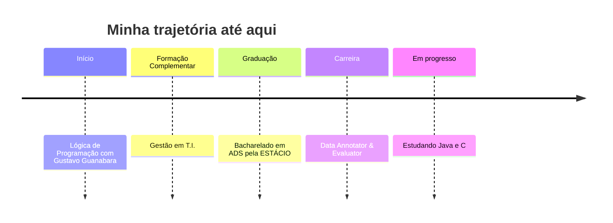

<div align="center">

# Olá, eu sou o Jhaylson 👋

### Estudante de ADS | Data Annotator & Evaluator | Construindo conhecimento todos os dias


<br/>

[](https://www.linkedin.com/in/jhaylson-concei%C3%A7%C3%A3o-205516359/)
[](https://www.instagram.com/sla.jlc?igsh=bXEzeTBmNGdteXJ4)
[](mailto:leonardejhaylson@gmail.com)

</div>

<br/>

## 💭 Sobre mim

```python
class Jhaylson:
    def __init__(self):
        self.nome = "Jhaylson"
        self.formacao = "Bacharelado em Análise e Desenvolvimento de Software — ESTÁCIO"
        self.cargo_atual = "Data Annotator & Evaluator"
        self.area_complementar = "Gestão em T.I."
        self.aprendendo = ["Java", "C"]
        self.origem_da_jornada = "Lógica de Programação com o Gustavo Guanabara (Curso em Vídeo)"

    def objetivo(self):
        return "Evoluir como desenvolvedor(a), unindo lógica sólida e visão de gestão de T.I."

me = Jhaylson()
```

- 🎓 Cursando **Bacharelado em Análise e Desenvolvimento de Software** pela **ESTÁCIO**
- 📺 Iniciei minha jornada em **lógica de programação** com as aulas do **Gustavo Guanabara** (Curso em Vídeo)
- 💼 Atualmente atuo como **Data Annotator & Evaluator**
- 📊 Tenho formação complementar em **Gestão em T.I.**
- 🌱 Aprendendo **Java** e **C**
- 💡 Domínio em **Python, HTML, CSS e JavaScript**

<br/>

## 🛠️ Tecnologias

<div align="center">

### Domínio sólido


### Aprendendo atualmente


</div>

<br/>

<details>
<summary>📦 <strong>Clique para ver os badges detalhados</strong></summary>

<br/>

<div align="center">


</div>

</details>

<br/>

## 📊 Estatísticas do GitHub

<div align="center">


<br/>


<br/>


</div>

<br/>

## 🏆 Conquistas

<div align="center">


</div>

<br/>

## 🚀 Jornada



<br/>

## 📈 Contribuições da semana (snake)

<div align="center">


</div>

> 💡 *Esse gráfico precisa de uma GitHub Action para ser gerado — veja as instruções na seção final.*

<br/>

## 📫 Vamos nos conectar

<div align="center">

Estou sempre aberto a trocar ideia sobre **tecnologia, programação e oportunidades** na área de T.I.

[](https://www.linkedin.com/in/jhaylson-concei%C3%A7%C3%A3o-205516359/)
[](https://www.instagram.com/sla.jlc?igsh=bXEzeTBmNGdteXJ4)
[](mailto:leonardejhaylson@gmail.com)

<br/>


</div>

<br/>

<div align="center">
<sub>🟢 Feito com dedicação por Jhaylson — sempre evoluindo, uma linha de código por vez.</sub>
</div>
