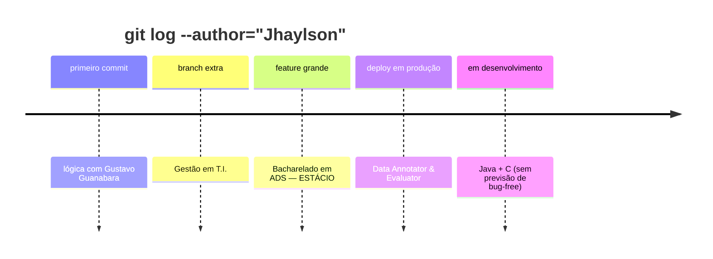

<div align="center">


<br/>


<br/><br/>

[](https://www.linkedin.com/in/jhaylson-concei%C3%A7%C3%A3o-205516359/)
[](https://www.instagram.com/sla.jlc?igsh=bXEzeTBmNGdteXJ4)
[](mailto:leonardejhaylson@gmail.com)


</div>

<br/>

## 💭 sudo cat sobre_mim.txt

```bash
$ cat /home/jhaylson/sobre_mim.md
```

> 🛸 plot twist: comecei mexendo no PC só pra resolver erro de jogo, virei dev no processo.

- 🎓 `bacharelando` em **Análise e Desenvolvimento de Software** — ESTÁCIO (ainda rodando, sem bugs críticos até agora)
- 📺 Ativei o **modo lógica de programação** vendo as aulas do **Gustavo Guanabara** (Curso em Vídeo) — o clássico de todo dev BR
- 💼 No momento: **Data Annotator & Evaluator** — ensinando IA a não fazer feio 🤖
- 📊 Bag extra: **Gestão em T.I.** (porque código bom sem organização é caos)
- 🌱 `[████████░░░░░░░░] 50%` aprendendo **Java** e **C**
- ⚡ Já no `sangue`: **Python, HTML, CSS e JavaScript**

```js
const jhaylson = {
  status: "compilando conhecimento...",
  bug: "nenhum, só features (por enquanto)",
  café: Infinity,
};
```

<br/>

## ⚡ stack_que_eu_uso.json

<div align="center">

### 🟢 já mando bem


### 🟡 grinding agora


</div>

<br/>

<details>
<summary>📦 <strong>clica aqui pra ver os badges no detalhe ⤵️</strong></summary>

<br/>

<div align="center">


</div>

</details>

<br/>

## 📊 stats.log — nem tudo é commit, mas quase

<div align="center">


<br/>


<br/>


</div>

<br/>

## 🏆 achievements_unlocked

<div align="center">


</div>

<br/>

## 🚀 changelog_da_vida.md



<br/>

## 🐍 contribution_snake.gif

<div align="center">


</div>

> ⚙️ esse aqui só ganha vida depois de ativar uma GitHub Action no seu repo — chama que eu te ensino.

<br/>

## 📡 manda um sinal

<div align="center">

sempre online pra trocar ideia sobre **tech, código e oportunidade**. bora conectar?

[](https://www.linkedin.com/in/jhaylson-concei%C3%A7%C3%A3o-205516359/)
[](https://www.instagram.com/sla.jlc?igsh=bXEzeTBmNGdteXJ4)
[](mailto:leonardejhaylson@gmail.com)

<br/>


</div>

<br/>

<div align="center">


<sub>🟢 console.log("feito com café, bugs e muita vontade de aprender — by Jhaylson");</sub>

</div>
